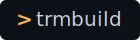

<p align="center">
    
</p>


Create terminal interfaces across console, web, and app with just 1 YAML file

# Features

- Create your own terminal in just 1 YAML file. No organizational headaches
- Easy to use and learn
- Can output in the console (eg. Windows Powershell), in a window (using Electron) or in the browser (using Serve)

# Quick Start
## Prerequisites

Requirements: 
- Node.js version 16 or higher
- npm (Comes with Node.js install. No current support for yarn and other package managers)

## 1. Install the package

Install terminal builder by doing
```bash
npm install trmbuild
```

## 2. Try it out

Refer to our [docs](./docs/) for detailed instructions on writing terminal.yaml . Or simply copy the [`terminal.yaml`](./terminal.yaml) file from the repo root and place it anywhere within your project where terminal-builder (trmbuild) is installed.

Once installed, build the ui
```bash
npm run trmbuild:ui
```

Then build the window
```bash
npm run trmbuild:window
```

# Scripts
|Script|Purpose|
|-|-|
|trmbuild:ui|Generates UI based on `terminal.json`|
|trmbuild:console|Launches console version|
|trmbuild:window|Opens UI in Electron|
|trmbuild:web|Serves UI in the browser|

# License
MIT License. Please read the [LICENSE.md](./LICENSE.md) for more details

# Contributing
Please read our [Contributing](./.github/CONTRIBUTING.md) file for more details